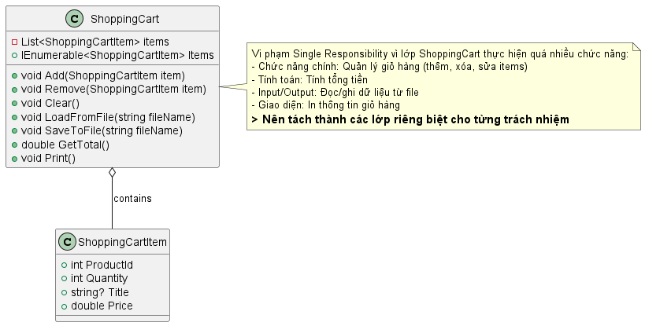
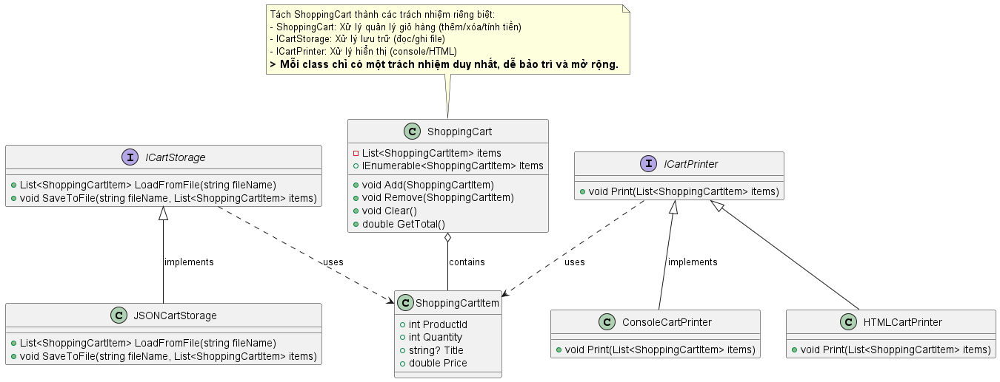
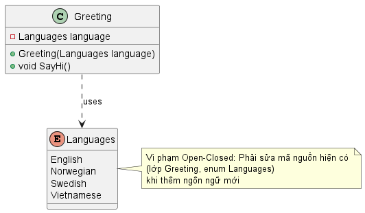
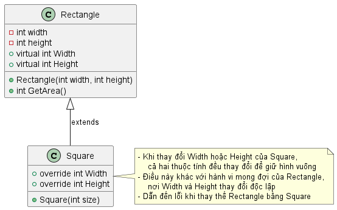
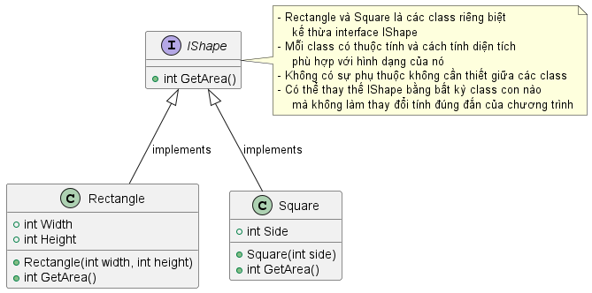
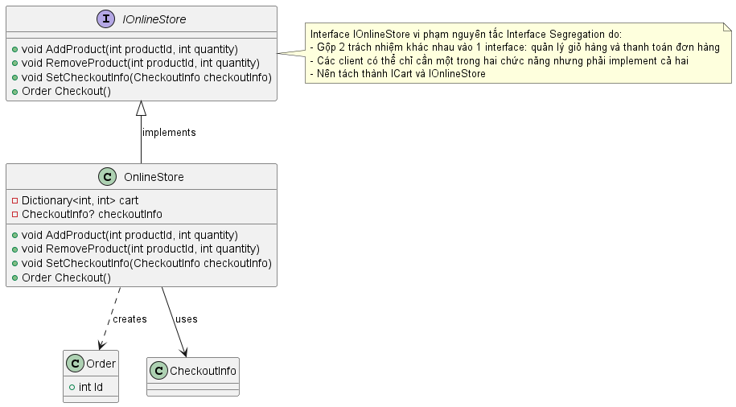
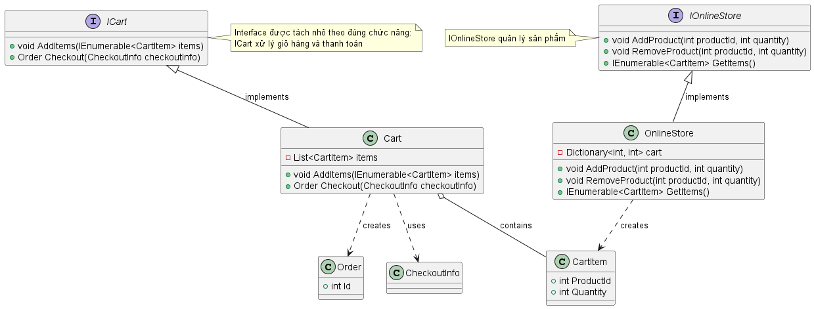
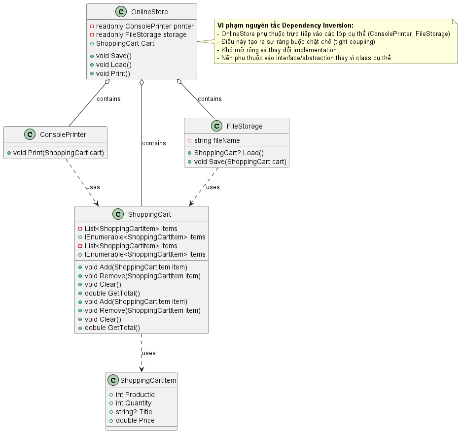
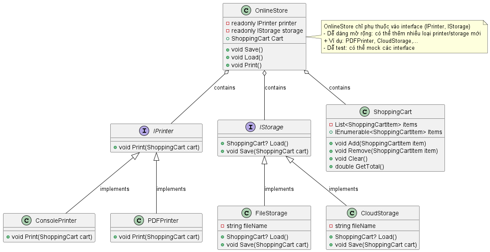

# SOLID-Bad-Designs

Đây là các ví dụ mẫu về năm nguyên tắc có tên SOLID, được dùng khi thiết kế các lớp trong lập trình hướng đối tượng (OOP).
Để dịch và chạy, bạn xem thêm trong phần "Dịch và chạy chương trình" phía dưới.
Năm nguyên tắc này gồm (bạn tham khảo các ví dụ trong từng thư mục tương ứng):

## Single Responsibility

Mỗi lớp chỉ phục vụ cho một mục đích duy nhất.
Lớp ShoppingCart vi phạm nguyên tắc này khi nó vừa là nơi chứa nội dung giỏ hàng, vừa có các chức năng để Load/Save, 
đồng thời có cả chức năng liên quan đến in nội dung giỏ hàng.

Nếu bạn muốn cho phép in ra theo dạng HTML thì sao? Bạn sẽ cần thêm vào một hàm PrintHTML()? Nếu bạn muốn lưu giỏ hàng
theo một cách khác thay vì chuyển thành JSON và lưu vào file? Bạn sẽ cần thêm các hàm để thực hiện việc này. Nếu phát hiện
một lỗi trong Print, bạn cũng sẽ phải dịch và triển khai lại cả các tính năng liên quan đến Load/Save.

Rõ ràng các tính năng Print và Load/Save chẳng liên quan đến nhau về mặt logic, nhưng lại được thiết kế dính chùm. Nếu
nhóm của bạn có hai người riêng biệt phụ trách hai nhóm chức năng trên, họ sẽ phải liên tục merge code của nhau, điều đáng ra 
hoàn toàn có thể tránh được.

Sẽ đơn giản hơn rất nhiều khi bạn thêm các interface như: ICartStorage với các hàm void Save(ShoppingCart)/ShoppingCart Load()...
ICartPrinter với void Print(ShoppingCart) và chuyển các hàm tương ứng sang các lớp con của các interface trên. Vì sao ta tạo 
ra các interface/abstract class rồi implement mà không làm trực tiếp luôn thì bạn có thể xem phần Dependency-Inversion trong 
bài này.
### Giải giáp tham khảo



## Open-Closed

Các lớp phải cho phép mở rộng, nhưng không cho phép thay đổi lại các tính năng đã có.

Trong ví dụ này, ta thiết kế lớp Greeting để hiển thị lời chào theo một ngôn ngữ nào đó. Thiết kế này không cho phép ta mở rộng,
bởi không có cách nào thêm một ngôn ngữ mới ngoài việc sửa lại mã nguồn của lớp Greeting cả. Giả sử bạn tạo một lớp con 
có tên GreetingEx thừa kế từ Greeting, thì bạn lại phải sửa enum Languages để thêm một ngôn ngữ mới, và như vậy lại xảy ra vấn đề khác,
đó là khi bạn gọi Greeting.SayHi (không phải GreetingEx.SayHi) với ngôn ngữ mới, Greeting.SayHi sẽ hoạt động sai. 

Đó chỉ là giả sử thôi, thực ra khi thay đổi enum Languages, bạn cũng đã thay đổi Greeting, bởi Greeting nhận vào Languages như
tham số.

Sẽ là hợp lý hơn khi bạn tạo một interface IGreeting như sau:

```csharp
public interface IGreeting
{
    void SayHi();
}
```

Và có các lớp:

```csharp
public class GreetingEn : IGreeting
{
    public void SayHi() {
      Console.WriteLine("Hi!");
    }
}

public class GreetingVi : IGreeting
{
    public void SayHi() {
      Console.WriteLine("Xin chào!");
    }
}
```
Bạn có thể mở rộng ra bao nhiêu ngôn ngữ cũng được mà không cần phải sửa lại mã nguồn của IGreeting.

### Giải pháp tham khảo


## Liskov Substitution

Nếu bạn có một con trỏ thuộc lớp cha, thì nó phải hoạt động hoàn toàn đúng đắn khi bạn trỏ nó đến bất kỳ lớp con nào.

Vì một hình vuông vốn cũng là một hình chữ nhật với các cạnh bằng nhau, nên trong lớp Square ta override lại các thuộc tính Width để khi thay đổi giá trị chúng sẽ tự động cập nhật lại Height. Điều này không có vấn đề gì nếu bạn có một biến 
```csharp
Square sqr = new Square(10);
```

Nhưng nếu bạn khai báo là:
```csharp
Rectangle rect = new Square(10);
rect.Width = 20;
```

Sau đó bạn mong muốn hình chữ nhật đó có diện tích bao nhiêu? Vì biến rect có kiểu Rectangle nên chắc chắn những người khác (và có thể cả bạn sau này) sẽ mặc nhiên coi nó trả về giá trị 200, nhưng thực chất nó sẽ trả về 400. 
### Giải pháp tham khảo


## Interface Segregation

Khi thiết kế các interface, mỗi interface sẽ phục vụ cho một mục đích nào đó, đừng tạo các interface kiểu "tất cả trong một".

IOnlineStore chứa định nghĩa các function, vốn phục vụ cho 2 mục đích hoàn toàn khác nhau: quản lý giỏ hàng và tạo đơn hàng. Bởi chúng được định nghĩa cùng nhau nên các lớp thừa kế bạn cũng phải viết cùng nhau, không thể tách riêng được (hãy xem lại phần Single Responsibility). Sẽ hợp lý hơn nếu bạn chia ra:

```csharp
    public interface IOnlineStore
    {
        Order Checkout(ICart cart, CheckoutInfo checkoutInfo);
    }
    
    public interface ICart {
        void AddProduct(int productId, int quantity);
        void RemoveProduct(int productId, int quantity);
        IEnumerable<CartItem> GetItems();
    }
```
### Giải pháp tham khảo


## Dependency-Inversion


Các lớp chỉ nên phụ thuộc vào các interface, không nên phụ thuộc vào các lớp cụ thể.

Trong lớp OnlineStore, bạn sử dụng ConsolePrinter và FileStorage. Điều đó có nghĩa bạn luôn phải gắn liền với một ConsolePrinter, dù có lúc bạn sẽ muốn in ra một máy in kiểu khác, hoặc dùng một cơ chế lưu trữ khác.
Ta hay mắc lỗi này khi thiết kế các lớp làm việc với database, hoặc API... kiểu như:

```csharp
    public OnlineStore(AzureAPIBackend backend) {
        this.backend = backend;
    }
```

Kiểu thiết kế này khiến ta bị dính chặt với AzureAPIBackend, sẽ rất khó nếu muốn test riêng lớp OnlineStore mà không thiết lập một API backend phía sau.
Bạn có thể thiết kế lại để tránh phụ thuộc vào AzureAPIBackEnd:

```csharp
    public OnlineStore(IAPIBackend backend) {
        this.backend = backend;
    }
```

Khi đó bạn có thể có:

```csharp
public class AzureAPIBackend: IAPIBackend 
{
}

public class FakeMemoryAPIBackend: IAPIBackend 
{
// lớp này chỉ lưu dữ liệu trong memory, được dùng để test
}

```

Vậy thì bạn có thể dễ dàng truyền vào một đối tượng FakeMemoryAPIBackend phù hợp để test lớp OnlineStore mà không cần phải setup cả một hệ thống backend trên Azure.

### Giải pháp tham khảo
